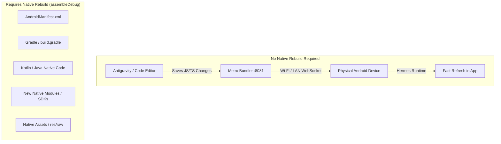

# Croww — Physical Android Wireless Development Guide

**Target Application:** Croww Mobile App (`croww-app`)  
**Target Device:** Physical Android Phone (Android 11+) over Wi-Fi / Local Area Network (LAN)  
**Development Architecture:** Expo Development Build (`expo-dev-client`) + Metro LAN Bundler + Hermes Engine + Fast Refresh  
**Package ID:** `com.croww.app`

---

## 1. Architecture Overview & Principles



### Core Rules:
1. **Never Rebuild for JS Changes:** All screen edits, layout changes, styles, animations, navigation tweaks, strings, and business logic update **instantly (< 1 second)** via Metro Fast Refresh over Wi-Fi.
2. **Never Use Expo Go:** Croww relies on native modules (`rive-react-native`, `react-native-maps`, `react-native-cashfree-pg-sdk`, `react-native-reanimated`). It requires the custom Expo development build (`com.croww.app` debug build).
3. **LAN Over Tunnel:** Connect Metro directly via `--lan` on the local Wi-Fi router. Never default to slow tunnels when both computer and phone share the same Wi-Fi network.
4. **Environment Isolation:** Development builds use the staging environment (`croww-staging-2026`). Live production configurations and rules remain 100% protected and untouched.

---

## 2. Phone Setup (One-Time)

### Step 1: Enable Developer Options
1. On your Android phone, open **Settings**.
2. Scroll down and select **About Phone** (or **System** → **About Phone**).
3. Locate **Build Number**.
4. Tap **Build Number 7 times** until you see the toast: *"You are now a developer!"*.
5. Return to **Settings** → **System** → **Developer Options**.

### Step 2: Enable Wireless Debugging
1. Ensure your Android phone is connected to the **same Wi-Fi network** as your development Mac.
2. Inside **Developer Options**, turn **ON** the following toggles:
   - **USB Debugging** (ON)
   - **Wireless Debugging** (ON)
   - *(If prompted: "Allow wireless debugging on this network?" → Check "Always allow on this network" and tap **Allow**).*

---

## 3. ADB Wireless Pairing & Connection

Android 11+ uses dynamic ports for pairing and connection. Follow these exact steps:

### Step 1: Obtain Pairing Info from Phone
1. In **Settings** → **Developer Options**, tap directly on the words **"Wireless debugging"** (not just the toggle) to open the details page.
2. Tap **"Pair device with pairing code"**.
3. A popup will display:
   - **Wi-Fi pairing code** (e.g. `123456`)
   - **IP address & Port** (e.g. `192.168.0.45:38475`)

### Step 2: Pair via Terminal
Run the following command on your Mac (replacing with the IP, port, and code displayed on your screen):

```bash
adb pair 192.168.0.XX:PORT CODE
# Example: adb pair 192.168.0.45:38475 123456
```
Output:
```text
Successfully paired to 192.168.0.45:38475 [guid=...]
```

### Step 3: Connect to Wireless Debugging
1. Look back at the main **Wireless debugging** screen on your phone.
2. Under **"IP address & Port"** (distinct from the pairing popup port), note the connect port (e.g. `192.168.0.45:41239`).
3. Run:
```bash
adb connect 192.168.0.XX:CONNECT_PORT
# Example: adb connect 192.168.0.45:41239
```
Output:
```text
connected to 192.168.0.45:41239
```

### Step 4: Verify Device Connection
```bash
adb devices -l
```
You will see your physical Android phone listed as `device`:
```text
List of devices attached
192.168.0.45:41239    device product:husky model:Pixel_8_Pro device:husky
```

> **Alternative (USB One-Time Setup for Android 10 or Below):**
> If your phone is running Android 10 or older, connect via USB cable once, run:
> ```bash
> adb tcpip 5555
> adb connect 192.168.0.XX:5555
> ```
> Then unplug the cable.

---

## 4. Metro LAN Development Setup

Metro serves the JavaScript and asset bundle to the physical device over your local Wi-Fi.

### Starting Metro:
```bash
cd croww-app
npx expo start --dev-client --lan
```
Or use the convenience npm script:
```bash
npm run dev:lan
```

Metro will output:
```text
Starting Metro Bundler
Metro waiting on exp+croww-app://expo-development-client/?url=http%3A%2F%2F192.168.0.135%3A8081
› Scan the QR code above with Expo Go (Android) or the camera app (iOS)
› Press a │ open Android
› Press r │ reload app
› Press m │ toggle menu
```

### Connecting the Phone:
1. When your phone is connected via ADB (`adb devices -l`), press **`a`** in the Metro terminal.
2. Metro will automatically invoke ADB to launch the development build on your phone:
   ```bash
   adb shell am start -a android.intent.action.VIEW -d "exp+croww-app://expo-development-client/?url=http%3A%2F%2F192.168.0.135%3A8081" com.croww.app
   ```
3. Alternatively, open the **Croww** app on your phone. It will automatically discover the local Metro server (`192.168.0.135:8081`) or let you tap the local server card.

---

## 5. Development Build (Debug APK)

Croww's development build incorporates all custom native modules (`rive-react-native`, `react-native-maps`, `react-native-cashfree-pg-sdk`, `react-native-reanimated`).

### How to Build the Development APK Locally:
```bash
cd croww-app/android
JAVA_HOME=/opt/homebrew/opt/openjdk@17 ./gradlew assembleDebug
```
The resulting debug APK is created at:
```text
android/app/build/outputs/apk/debug/app-debug.apk
```

### Installing on Physical Phone via ADB:
```bash
adb install -r android/app/build/outputs/apk/debug/app-debug.apk
```

---

## 6. Fast Refresh Verification Workflow

Once the app is connected to Metro, **every normal JavaScript/UI edit is live-reflected without building an APK**:

1. **Text & Copy:** Edit any string or heading in `src/screens/` → Phone re-renders with the new text within 200–500ms.
2. **Spacing & Theme:** Adjust padding, margins, or colors in `src/constants/theme.js` → All screens immediately adopt the updated palette.
3. **Components & Layout:** Modify cards, inputs, buttons in `src/components/` → Instant update preserving component state.
4. **Navigation Flow:** Add screen options or transition animations in `src/navigation/` → Fast Refresh applies without losing the active screen stack.

### Developer Menu & Reload Shortcuts:
- **Reload App:** Press **`r`** in the Metro terminal or double-tap **`R`** on the phone screen.
- **Open Dev Menu:** Press **`m`** in the Metro terminal, or run:
  ```bash
  adb shell input keyevent 82
  ```
  *(Options: Enable/Disable Fast Refresh, Show Element Inspector, Toggle Performance Monitor).*

---

## 7. Native Change Workflow: When to Rebuild vs. When to Refresh

| Change Type | Examples | Fast Refresh? | Rebuild Required? |
|---|---|---|---|
| **Screens & UI** | `ExploreScreen.js`, `PostScreen.js`, `ListingScreen.js` | **YES (< 1s)** | **NO** |
| **Components & Styling** | `NotionCard.js`, `Typography.js`, `theme.js` | **YES (< 1s)** | **NO** |
| **Services & Domain** | `listingService.js`, `propertyService.js`, `posting.ts` | **YES (< 1s)** | **NO** |
| **Hooks & State** | `useTaxonomy.js`, `ExploreContext.js`, `AuthContext.js` | **YES (< 1s)** | **NO** |
| **Navigation Routes** | `AppNavigator.js`, `PropertyTabNavigator.js` | **YES (< 1s)** | **NO** |
| **Android Manifest** | Permissions, intent filters, orientation, theme | NO | **YES (`assembleDebug`)** |
| **Gradle / Build Config** | `build.gradle`, `gradle.properties`, JVM options | NO | **YES (`assembleDebug`)** |
| **Kotlin / Java Native Code** | `MainActivity.kt`, `MainApplication.kt`, custom modules | NO | **YES (`assembleDebug`)** |
| **Native Packages** | Adding new packages with C++/JNI/Java dependencies | NO | **YES (`assembleDebug`)** |
| **Rive Raw Bundled Assets** | Adding new `.riv` files to `res/raw/` | NO | **YES (`assembleDebug`)** |
| **Google Maps Native Key** | Modifying Google Maps API key placeholder in AndroidManifest | NO | **YES (`assembleDebug`)** |

---

## 8. Rive Animation Verification

Croww uses `rive-react-native` for brand motion and micro-interactions:
- **Artboards Tested:** `CrowwBrand` (`croww-logo.riv`), `SaveBookmark` (`save.riv`), `LocationShare` (`location-share.riv`), `PostWizard` (`post-wizard.riv`), `EmptyDiscovery` (`empty-states.riv`), `SuccessBadge` (`success.riv`).
- **Native Raw Assets:** Bundled directly in `android/app/src/main/res/raw/` (`croww_logo.riv`, etc.).
- **Fast Refresh Resilience:** `CrowwRiveView.native.js` includes error boundary traps (`hasError`), input reconciliation, and automatic fallback to `CrowwRiveFallback.js`. If Fast Refresh swaps component props, Rive state machines reset cleanly without causing native runtime crashes.

---

## 9. Google Maps Verification

Croww uses `react-native-maps` on Android:
- **API Key Configuration:** Injected from `EXPO_PUBLIC_GOOGLE_MAPS_API_KEY` into `AndroidManifest.xml` via Gradle `manifestPlaceholders`.
- **Hardware Acceleration:** Enabled by default on physical Android devices, providing 60fps smooth pan, tilt, and zoom.
- **Markers & Clustering:** Property markers render natively via `Marker` and `Callout`.
- **Public vs. Private Pins:** Exact coordinates remain isolated in Firestore `private_geo/current`; the map on the physical phone displays only the derived, jittered public pin.

---

## 10. Firebase & Environment Separation

| Parameter | Development / Staging Build | Production Release Build |
|---|---|---|
| **Build Variant** | `debug` (`assembleDebug`) | `release` (`assembleRelease` / App Bundle) |
| **Firebase Project** | `croww-staging-2026` | `croww-live-2026` |
| **Google Services JSON** | `google-services.staging.json` | `google-services.json` |
| **Dev Client Enabled** | **YES** (`expo-dev-client`) | **NO** (Stand-alone binary) |
| **Metro Connection** | **YES** (`192.168.0.135:8081`) | **NO** (Embedded JS bundle) |
| **Cashfree PG Mode** | `TEST` (Sandbox PG) | `PRODUCTION` (Live PG) |
| **Switch Command** | `npm run set-env:staging` | `npm run set-env:production` |

---

## 11. Daily Developer Workflow (Cheat Sheet)

```bash
# 1. Connect phone (once per session if IP changed)
adb connect 192.168.0.XX:CONNECT_PORT

# 2. Verify connection
adb devices -l

# 3. Start Metro on LAN
npm run dev:lan

# 4. Open Croww on your phone
# Either tap the Croww app icon or press 'a' in the Metro terminal

# 5. Code in Antigravity → Save → Live Refresh on Phone!
```

---

## 12. Troubleshooting Guide

### 1. Phone Not Visible to ADB (`adb devices -l` is empty)
- **Check Wi-Fi:** Verify both the Mac and the Android phone are on the exact same Wi-Fi SSID and subnet (e.g. `192.168.0.x`). Disable AP isolation / guest network on router if enabled.
- **Port Changed:** Android 11+ changes the wireless debugging port upon every Wi-Fi disconnect/reconnect. Check the port in Developer Options and re-run `adb connect 192.168.0.XX:<new_port>`.
- **Restart ADB Server:**
  ```bash
  adb kill-server && adb start-server
  ```

### 2. Metro Cannot Be Reached from Phone
- **Mac Firewall:** Ensure macOS Firewall allows incoming connections on port 8081:
  - System Settings → Network → Firewall → Options → Ensure node / Terminal is allowed.
- **IP Address Mismatch:** If your Mac changed IP (e.g. DHCP renewal), check your LAN IP:
  ```bash
  ipconfig getifaddr en0
  ```
  Then restart Metro with `npm run dev:lan`.

### 3. Port 8081 Occupied by Stale Process
- Check who is using port 8081:
  ```bash
  lsof -i :8081
  ```
- Terminate stale node instances:
  ```bash
  kill -9 <PID>
  ```

### 4. Fast Refresh Not Triggering
- Shake the phone (or run `adb shell input keyevent 82`) to open the Expo Dev Menu.
- Ensure **"Fast Refresh"** is set to **Enabled**.

### 5. Google Maps Showing Blank / Beige Screen
- Check that the phone has internet access to download Google Maps tiles.
- Verify `EXPO_PUBLIC_GOOGLE_MAPS_API_KEY` is set in `.env` and that Android package `com.croww.app` SHA-1 fingerprint is authorized in the Google Cloud Console for the staging/dev key.

### 6. Rive Resource Not Found
- Ensure `.riv` files exist in `android/app/src/main/res/raw/`. Android raw resource names must use underscores (`croww_logo.riv`), never hyphens.

---

## 13. Summary of Daily Commands

| Goal | Command |
|---|---|
| **Check Connected Devices** | `adb devices -l` |
| **Pair Wireless Device** | `adb pair <IP>:<PAIRING_PORT> <CODE>` |
| **Connect Wireless Device** | `adb connect <IP>:<PORT>` |
| **Start Metro on LAN** | `npm run dev:lan` |
| **Launch App on Phone** | Press `a` in Metro terminal or tap app icon on phone |
| **Open Dev Menu Remotely** | `adb shell input keyevent 82` |
| **Reload JavaScript Remotely** | Press `r` in Metro terminal or `adb shell input text "rr"` |
| **Rebuild Native Debug APK** | `cd android && JAVA_HOME=/opt/homebrew/opt/openjdk@17 ./gradlew assembleDebug` |
| **Install Debug APK to Phone** | `adb install -r android/app/build/outputs/apk/debug/app-debug.apk` |
| **View Real-Time Android Logs**| `adb logcat -s ReactNativeJS:V AndroidRuntime:E Metro:V` |
