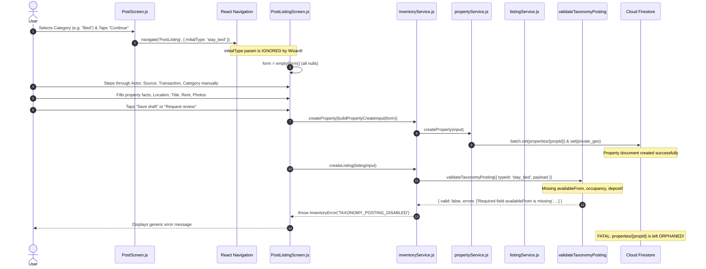

# Croww Property & Listing Creation Flow Audit

**Date:** 2026-09-20  
**Target:** Staging (`croww-staging-2026`) & Local Client (`croww-app`)  
**Scope:** End-to-end audit of property and listing creation across all 6 launch accommodation categories (Bed, Shared Room, Private Room, PG, Co-living, Roommate Replacement).

---

## 1. Executive Summary & Problem Statement

The Croww property posting flow was failing end-to-end: users selecting an accommodation category on `PostScreen` could not successfully create a property and listing in staging.

Our investigation of the entire call chain—from the initial category card tap on `PostScreen` down to the Firestore document writes—revealed multiple cascading blockers:
1. **Parameter Drop at Entry:** `PostScreen.js` passed `{ initialType: selectedType }` via React Navigation, but `PostListingScreen.js` never read `route.params?.initialType`. The selected category was discarded, and the form defaulted to empty null fields, forcing the user into a redundant 4-step wizard before reaching details.
2. **Taxonomy Validation Breakdown:** `inventoryService.createListing` enforces server-driven taxonomy validation via `validateTaxonomyPosting`. For all 6 launch stay categories, `requiredFields` in `defaults.ts` mandatorily require `availableFrom`, `occupancy` (for Bed, Shared Room, PG), and `deposit`. However, `PostListingScreen.js` and `posting.ts` never captured, rendered, or mapped `availableFrom` or `occupancy`, and treated `deposit` as optional. Consequently, every single listing submission failed taxonomy validation with fatal missing-field errors (`TAXONOMY_POSTING_DISABLED`).
3. **Orphaned Property Generation:** In `PostListingScreen.js`, `persistDraft` wrote `propertyService.createProperty` first. When `listingService.createListing` subsequently failed on taxonomy validation, the newly created property document (`properties/{id}`) and its subdocument (`private_geo/current`) remained orphaned in Firestore without any compensating rollback.
4. **Missing Field Visibility for Accommodation Types:** Form field visibility in `propertyFieldVisibility` (`posting.ts`) and input rendering did not properly expose accommodation-specific fields (occupancy, move-in date / availability, food inclusion, furnishing, bathroom access) while hiding irrelevant residential fields (BHK counts on single beds / shared rooms).
5. **Opaque Error Recovery:** When backend or taxonomy validation failed, `inventoryErrorMessage` lacked specific mappings for `TAXONOMY_POSTING_DISABLED`, producing generic "Something went wrong" messages that left users unable to diagnose or correct input issues.

---

## 2. Actual Call Chain Trace (Current State)

---

## 3. Root Cause Analysis

### Root Cause 1: Navigation Parameter Disconnection
- **File:** `src/screens/property/PostListingScreen.js`
- **Issue:** `PostScreen.js` executes `navigation.navigate('PostListing', { initialType: selectedType })`. However, `PostListingScreen.js` only checked `route.params?.listingId`. The `initialType` was never read into state.
- **Impact:** The category selected by the user on the primary Post tab was discarded. The user had to re-navigate through redundant steps (`actor`, `source`, `transaction`, `category`).

### Root Cause 2: Taxonomy Required Fields Schema Incompatibility
- **Files:** `src/domain/taxonomy/defaults.ts`, `src/domain/taxonomy/validation.ts`, `src/domain/property/posting.ts`, `src/screens/property/PostListingScreen.js`
- **Issue:** The taxonomy contracts for the 6 stay categories require:
  - `stay_bed`: `['monthlyRent', 'deposit', 'occupancy', 'availableFrom']`
  - `stay_shared_room`: `['monthlyRent', 'deposit', 'occupancy', 'availableFrom']`
  - `stay_private_room`: `['monthlyRent', 'deposit', 'availableFrom']`
  - `stay_pg`: `['monthlyRent', 'deposit', 'occupancy', 'availableFrom']`
  - `stay_coliving`: `['monthlyRent', 'deposit', 'availableFrom']`
  - `stay_roommate_replacement`: `['monthlyRent', 'deposit', 'availableFrom']`
- `PostListingScreen.js` and `posting.ts` lacked `availableFrom` and `occupancy` in `emptyForm`, input rendering, and payload building. Furthermore, `deposit` was optional and often omitted, causing `validateTaxonomyPosting` to reject draft creation unconditionally.

### Root Cause 3: Non-Atomic Creation & Lack of Compensating Rollback
- **Files:** `src/screens/property/PostListingScreen.js`, `src/services/property/inventoryService.js`
- **Issue:** `persistDraft` creates the property in Firestore via `inventoryService.createProperty`, then calls `inventoryService.createListing`. If `createListing` fails, the newly created property document is not rolled back or cleaned up.
- **Impact:** Orphaned properties accumulate in Firestore. Subsequent retry attempts create additional orphan properties.

### Root Cause 4: Accommodation / Stay Field Visibility & Form Defaults
- **Files:** `src/domain/property/posting.ts`, `src/screens/property/PostListingScreen.js`
- **Issue:** When listing an accommodation (bed, shared room, private room, PG, co-living, roommate replacement):
  - `transactionType` is strictly `'rent'`.
  - `category` is strictly `'residential'`.
  - `bedrooms` is 1 for a single bed or private room; BHK selector is not applicable.
  - Required stay attributes (`availableFrom`, `occupancy`, `deposit`) must be captured in the form.

### Root Cause 5: Error Messaging & Code Mapping Gap
- **File:** `src/domain/property/posting.ts` (`inventoryErrorMessage`)
- **Issue:** When `TAXONOMY_POSTING_DISABLED` or specific validation failures occur, the error message fallback is generic ("Something went wrong"). The UI gave no indication of which required fields caused rejection.

---

## 4. Remediation Plan & Fixes

### A. Navigation & Form Initialization
- In `PostListingScreen.js`, inspect `route.params?.initialType`.
- If `initialType` is provided (e.g. `stay_bed`, `stay_pg`), initialize:
  - `listingTypeId: initialType`
  - `taxonomyId: initialType`
  - `transactionType: 'rent'`
  - `listedByRole: 'owner'`
  - `category: 'residential'`
  - `subtype: mapTaxonomyToLegacy(initialType).subtype`
  - `bedrooms: mapTaxonomyToLegacy(initialType).defaultBedrooms || 1`
  - `availableFrom: 'immediate'`
  - `occupancy: defaultOccupancyForType(initialType)`
  - `stepKey: 'property'` (proceed directly to property facts, skipping redundant actor/source/transaction/category steps)

### B. Accommodation Data Capture & Payload Mapping
- Extend `emptyForm()`, `hydrateForm()`, and `buildListingCreateInput()` in `posting.ts` to include:
  - `availableFrom` (defaulting to `'immediate'` or selectable date/option)
  - `occupancy` (for bed/shared room/pg: single, double, triple, 4+)
  - `depositText` (defaulting to ₹0 or explicit amount)
  - `foodIncluded` and `genderPreference` as appropriate for PG/Co-living/Stay
- Add UI inputs in `PostListingScreen.js` for `availableFrom` and `occupancy` when `isStay` is true.

### C. Compensating Rollback to Prevent Orphan Properties
- In `persistDraft`:
  - If a new property is created during the current submission and `createListing` throws an error, immediately execute a compensating delete of `properties/{newPropertyId}` and `private_geo/current` (or reset `form.propertyId` and clean up) so that no orphan document is left behind.

### D. Clear Error Diagnostics
- Update `inventoryErrorMessage` in `src/domain/property/posting.ts` to handle:
  - `TAXONOMY_POSTING_DISABLED`: Return the specific missing fields or validation error from the taxonomy engine.
  - `INVALID_LISTING`: Provide detailed diagnostic feedback.

---

## 5. Files Changed

| File | Change Description |
|------|--------------------|
| `src/screens/property/PostListingScreen.js` | Read `initialType` route param, fast-track accommodation flow, add `availableFrom` & `occupancy` inputs, implement compensating rollback on listing creation failure. |
| `src/domain/property/posting.ts` | Update `emptyForm`, `buildPropertyCreateInput`, `buildListingCreateInput`, `canSaveDraft`, `canRequestPublish`, and `inventoryErrorMessage` to support stay required fields. |
| `src/domain/taxonomy/validation.ts` | Ensure deposit defaults (e.g. 0 / none) are handled cleanly without rejecting valid zero-deposit rentals. |
| `src/services/property/propertyService.js` | Add `deleteProperty` compensating method for client rollback of uncommitted draft properties created in the same session. |
| `src/services/property/inventoryService.js` | Add rollback handling in `createListing` or allow transactional cleanup if listing creation fails. |

---

## 6. Backend & Security Impact

- **Firestore Rules:** No loosening of security rules. `properties` continue to require unverified blocks, valid coordinates within India, and non-authoritative source flags. `listings` continue to require `status == 'DRAFT'`, valid foreign key to `properties/{propertyId}`, and correct actor identity.
- **Location Privacy:** Exact coordinates remain strictly confined to `properties/{id}/private_geo/current`. Public documents (`properties/{id}` and `listings/{id}`) receive public pins only.
- **Data Model Integrity:** Elimination of orphaned properties and listings. Strict consistency across `properties`, `listings`, and `property_media`.

---

## 7. Next Actions

1. Implement the required fixes in `src/domain/property/posting.ts` and `src/screens/property/PostListingScreen.js`.
2. Implement compensating cleanup for failed listing creations.
3. Test end-to-end creation for all 6 categories:
   - Bed
   - Shared Room
   - Private Room
   - PG
   - Co-living
   - Roommate Replacement
4. Generate `docs/PROPERTY_CREATION_TEST_REPORT.md` with the full verification matrix.
